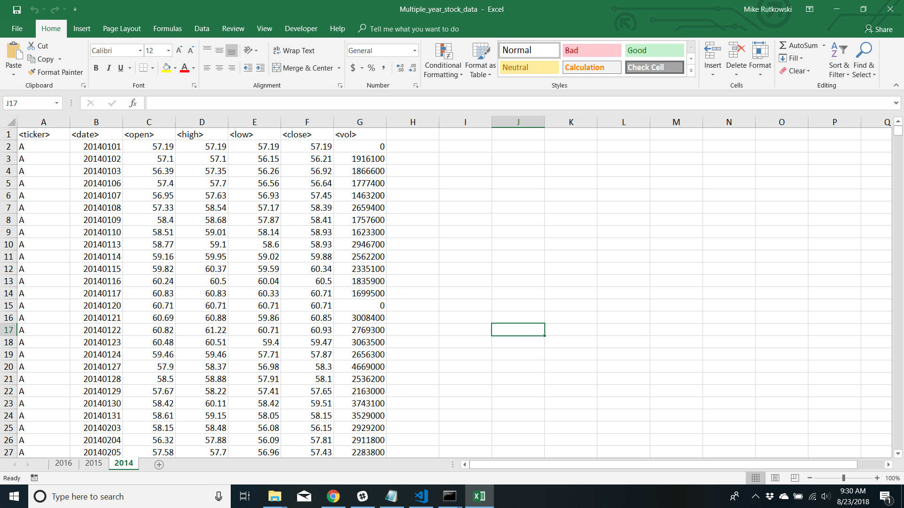
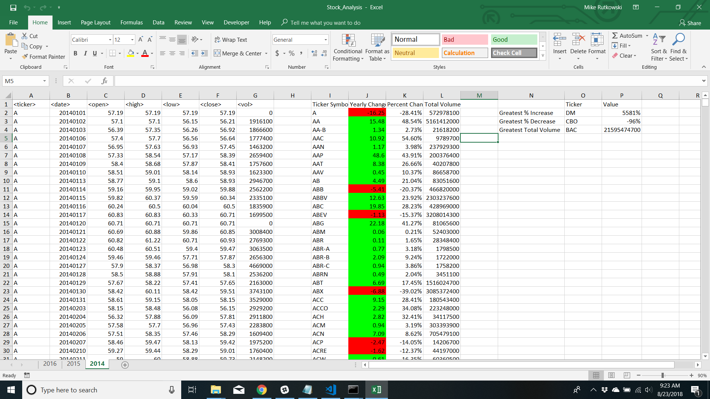

The goal of this project was to use VBA scripting to analyze the data of different stocks.  The dataset includes three years of data, each on a different worksheet that the code will work on reguardless of column length.  Included in this repo is this README which contains a description of the project and the VBA code, a .vbs file with the code that can be run, and a folder with the Excel Macro-Enabled Worksheet containing the data that the code was run on, which unfortunately can not be viewed on github and has to be downloaded to view. Because the file cannot be viewd here, a before and an after screenshot will be included at the end of this README. 

What the code does:

- Grab the total amount of volume each stock had for the year and display it with the corresponding ticker symbol.

- Grab the yearly change from the stock open to the year close and display that number and the percent change.

- Check to make sure there is not a divide by 0 error.

- Locate and display the stock with the greatest % increase, the stock with the greatest % decrease and stock with the greatest total volume for the year.

- Repeate for each worksheet

- Also used conditional formating to color a positive yearly change in green and a negative change in red.

Before and After Screenshots:

Before:

After:
